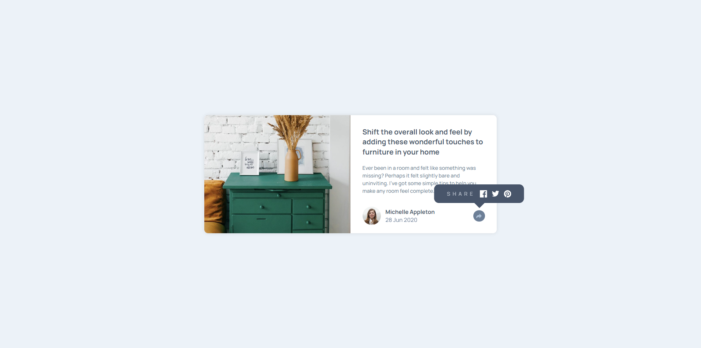
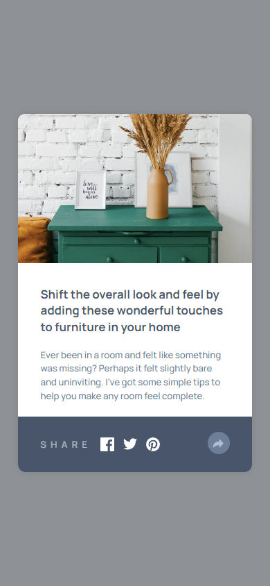

# Vista previa de artículo

Este proyecto es una propuesta de solución para uno de los desafios de __Frontend Mentor__, todos los recursos utilizados fueron obtenidos mediante dicha plataforma.

El contenido de este repositorio contempla una página web en la que se muestra una tarjeta con un diseño _responsive_.

## Contenidos

- [Descripción](#descripción)
  - [Desafío](#desafío)
  - [Screenshot](#screenshot)
  - [Links](#links)
- [Proceso](#proceso)
  - [Hecho con](#hecho-con)
  - [Lo que aprendí](#lo-que-aprendí)

## Descripción

### Desafío

El desafio propuesto fue emplear el uso de Javascript para manejar eventos e interacciones que se presentan en el DOM. En este caso, dentro de la página se puede visualizar un botón en el que, una vez presionado, se muestra contenido adicional sobre compartir el contenido en redes sociales.

La particularidad es la manera en como se visualiza este contenido, en una vista de telefono, el contenido aparece por debajo de la tarjeta, mientras que en una vista desde un computador, el contenido se visualiza como un globo de texto por sobre el contenido de la tarjeta.

### Screenshot

#### Escritorio


#### Movil


### Links

- Sitio: [-](#)

## Proceso

### Hecho con

- HTML
- CSS
  - Flexbox
  - Grid
  - Flujo de trabajo _mobile-first_
- JavaScript

### Lo que aprendí

Para este desafio aprendí sobre el manejo del DOM dentro de JavaScript, aunque en un principio pensaba no utilizarlo dado la complejidad del desafio, pero con el transcurso del proyecto tuve que hacer modificaciones que implicaban utilizar el manejo de clases que pudiera tener o no cada elemento.

Además, aprendi a mostrar contenido personalizado con la propiedad ```position: absolute``` dentro de un contenedor, esto con el fin de mostrar como un globo de texto cierto contenido dentro de la tarjeta, ya que este contenido se visualiza de otra manera en un vista para télefonos.